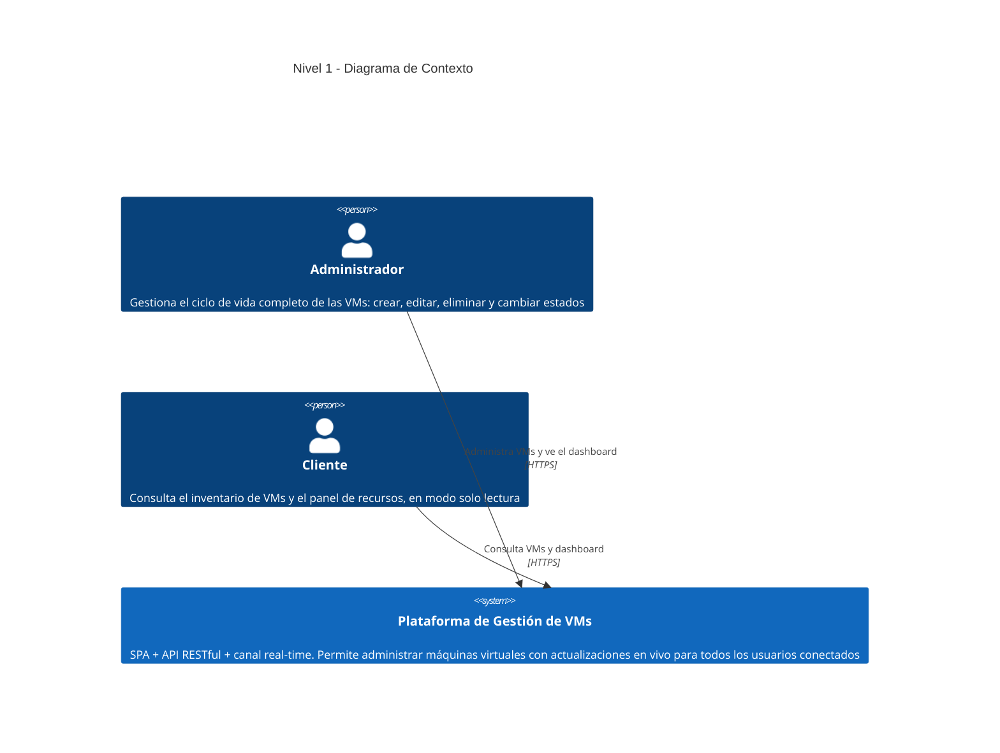
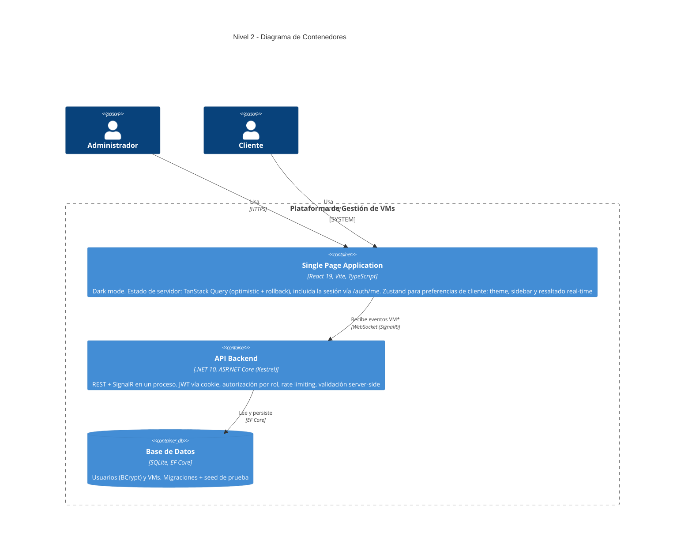
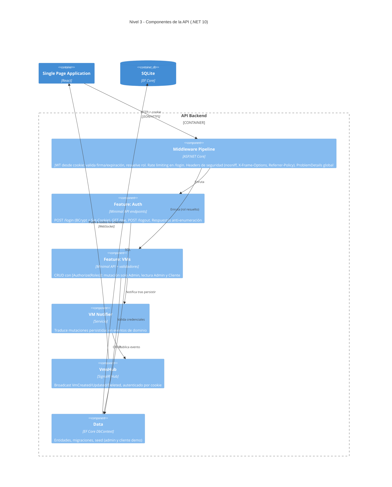
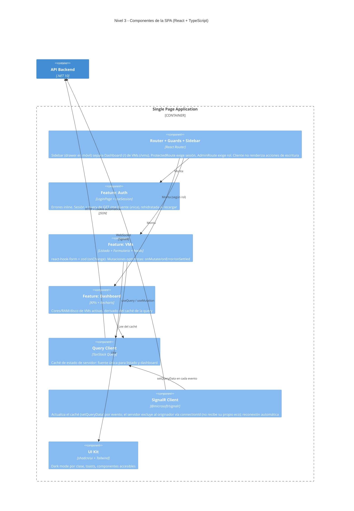
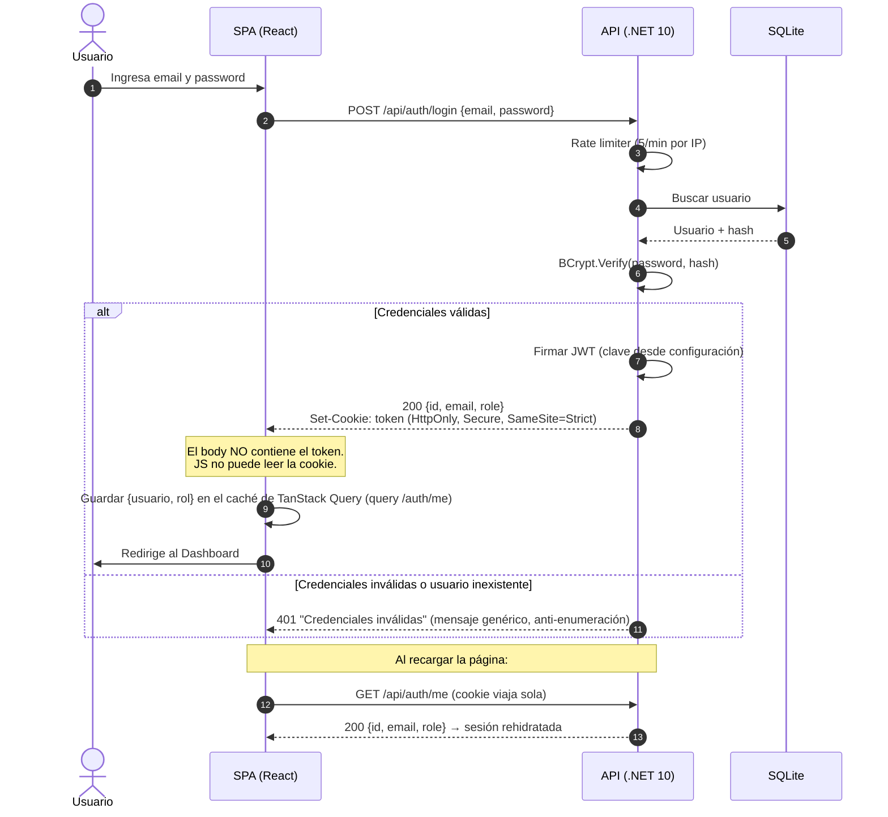
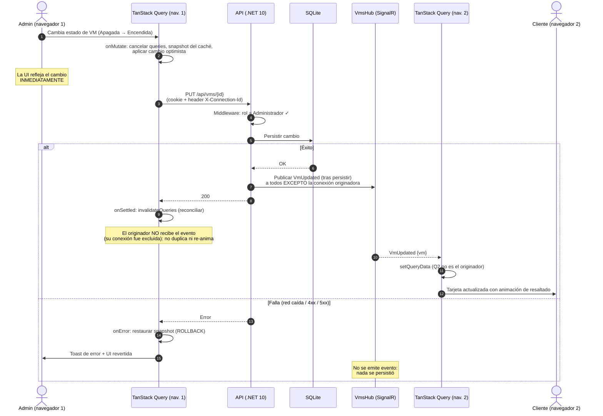

# Arquitectura — Modelo C4

> Documentación de arquitectura siguiendo el [modelo C4](https://c4model.com/) (Context,
> Containers, Components), complementada con diagramas de secuencia de los dos flujos críticos
> del sistema. Notación C4 en sintaxis Mermaid para que GitHub los renderice nativamente,
> sin herramientas adicionales para el lector.

---

## Nivel 1 — Contexto del sistema

Quién usa el sistema y con qué propósito. Los dos roles interactúan con la misma plataforma,
pero con capacidades distintas (autorización aplicada en el backend).

---

## Nivel 2 — Contenedores

Las piezas ejecutables/desplegables del sistema y cómo se comunican. Punto clave de seguridad:
la SPA nunca manipula el token — la cookie `HttpOnly` viaja automáticamente en cada petición
HTTP **y** en el handshake del WebSocket.

> **Nota de diseño:** el hub de SignalR corre dentro del mismo proceso que la API (no es un
> contenedor separado). Es deliberado: a esta escala, un servicio real-time independiente
> agregaría latencia de red interna y complejidad operativa sin beneficio. Se separaría si el
> volumen de conexiones concurrentes lo exigiera (ver trade-offs en el README).

---

## Nivel 3 — Componentes de la API

Zoom al contenedor backend: pipeline de middleware, features verticales y el punto exacto
donde nace el evento real-time (después de persistir, nunca antes).

---

## Nivel 3 — Componentes de la SPA

Zoom al contenedor de frontend: separación
estricta entre estado de servidor (TanStack Query) y estado de cliente (Zustand), y el guard
de rutas que oculta —no deshabilita— las capacidades según rol.

---

## Secuencia 1 — Autenticación con cookie HttpOnly

El token jamás toca JavaScript.

---

## Secuencia 2 — Mutación con Optimistic UI + broadcast real-time

Rollback ante fallo y actualización instantánea en los demás clientes conectados.

---

## Cómo leer esta documentación

| Diagrama | Pregunta que responde |
|---|---|
| Contexto (C4-1) | ¿Quién usa el sistema y para qué? |
| Contenedores (C4-2) | ¿Qué piezas ejecutables existen y por qué canales se hablan? |
| Componentes API (C4-3) | ¿Dónde se aplica la seguridad y dónde nace el evento real-time? |
| Componentes SPA (C4-3) | ¿Cómo se separa estado de servidor/cliente y cómo se ocultan capacidades por rol? |
| Secuencia auth | ¿Por qué el token nunca toca JavaScript? |
| Secuencia optimistic + real-time | ¿Qué pasa exactamente al mutar, al fallar, y en los demás clientes? |
